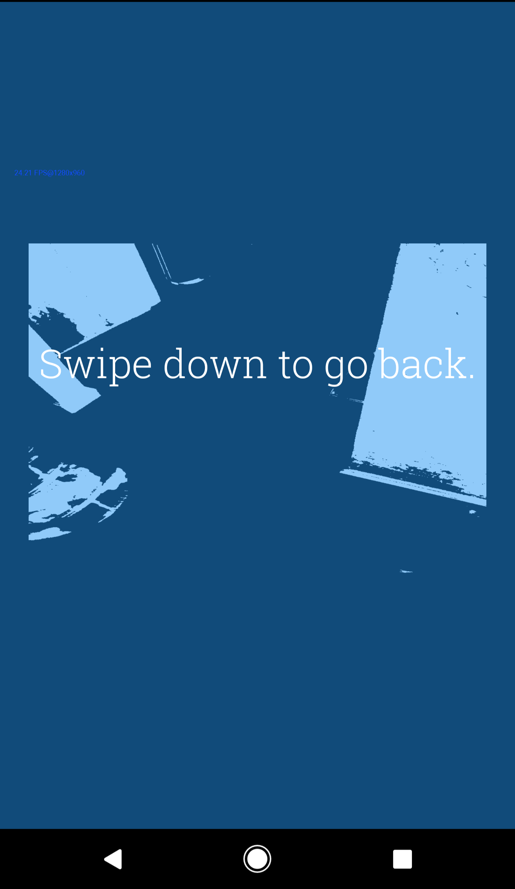

# AIVision

## Background

This is a hackathon project that the Planeteers team built during the Android Developer Career Summit at Google (Nov 2015). The team *won best technical award* for our app allowing people with impaired vision to navigate indoors.

Media: http://blog.udacity.com/2015/12/udacity-android-developers-attend-google-career-summit.html

Google Play: https://play.google.com/store/apps/details?id=com.planeteers.aivision
(also requires installing OpenCV Manager / org.opencv.engine when launching)

## Features

* obstacle detection: hold the device with the camera towards the floor to detect obstacles (described below)
* image to speech: take a picture and use image tagging APIs to describe the user's surroundings
* photo gallery to speech

## Obstacle Detection

Using image thresholding, obstacles that stand out from a dark-colored floor will make the device vibrate, letting the user know their passage is blocked. Since the device is assumed to lack a depth camera, its gyro is used and an auditory signal will increase in frequency along with a voice alert, which instruct the user to tilt the device if the camera is oriented too far into the distance.

